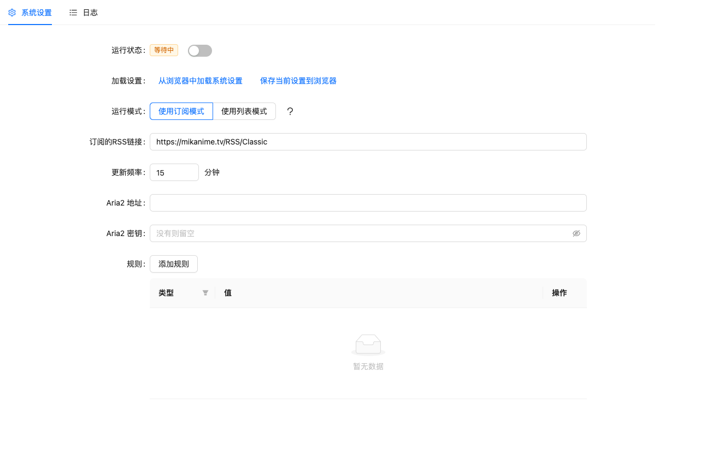

# Mikan Helper

如果你希望在一般的系统中使用，你可以尝试使用[Motrix](https://motrix.app/)，如果你在服务器上使用，建议使用Docker安装Aria2

本项目由Python & Vue开发

## 截图


## 使用

### 使用Docker安装

你可以通过命令先创建一个Docker镜像:

```bash
# 假设你当前位于项目目录中
docker build -t mikan-helper .
# 注意最后有一个点
```

然后你需要运行这个Docker容器

```bash
# 注意，主机端口号需要你自行设定，如果你的8811端口号没有被占用，你可以设定主机端口也为8811
docker run -d -p <主机端口>:8811 mikan-helper --restart always
```

### 通用步骤
- 安装[Python3](https://www.python.org/)，你可以通过官网下载安装，或者Linux的`apt`进行安装
- 安装所需要的依赖，你也可以手动安装
  ```bash
  pip3 install requests
  pip3 install feedparser
  # 根据你的Python安装方式，也有可能为
  pip install requests
  pip install feedparser
  # 如果你的Python是通过Linux apt安装的，也有可能为
  apt install python3-requests
  apt install python3-feedparser
  ```
- 执行命令来运行服务
  ```bash
  python3 main.py
  # 根据你的Python3安装方式也有可能为
  python main.py
  # 在Linux中如果你想要保持后台运行，可以执行
  nohup python3 main.py&
  ```

### 如果使用Motrix

如果你想使用Motrix作为下载工具，你可以遵循以下步骤

- 从[Motrix官方网站](https://motrix.app/)下载安装Motrix
- 确认你的Motrix中Aria2的RPC端口号，位于`偏好设置 - 进阶设置 - PRC 监听端口`，默认为16800；默认的RPC 密钥为空 (即不需要密钥)，你可以自定义你的密钥
  
### 如果使用Aria2

这里以使用Docker安装Aria2为例

注意保存自己设定的端口号 (对应容器的端口号为PRC_PORT) 和 RPC_SECRET

### 配置信息

你需要前往`http://<ip地址>:8811`中配置信息

本项目有两种模式: 订阅模式和列表模式

- 订阅模式你需要填写你的Mikan订阅地址，RSS地址一般为`https://mikanime.tv/RSS/MyBangumi?token=`，此时你需要前往Mikan网站自行订阅需要下载的番剧
- 列表模式会从所有的番剧中筛选下载，RSS地址固定为`https://mikanime.tv/RSS/Classic`，此时你需要手动添加番剧，填写内容为`字幕组`和`标题`

除此之外，你还可以添加规则，比如排除`720P`，必须包含`1080P`等等

### 停止服务

你可以选择只是停止监听和停止整个服务

如果你想要停止监听，在`http://<ip地址>:8811`中关闭服务就可以了  
如果你想要停止整个服务，结束终端就可以了。如果你使用通过`nohup`在后台运行的，通过命令`ps aux | grep python`找到进程号（一般为第二列），通过命令`kill <进程id>`即可

## 部署
```bash
sudo docker build -t mikan_helper .
sudo docker run -d --restart always -p 8811:8811 --name mikan_helper <镜像id>
```